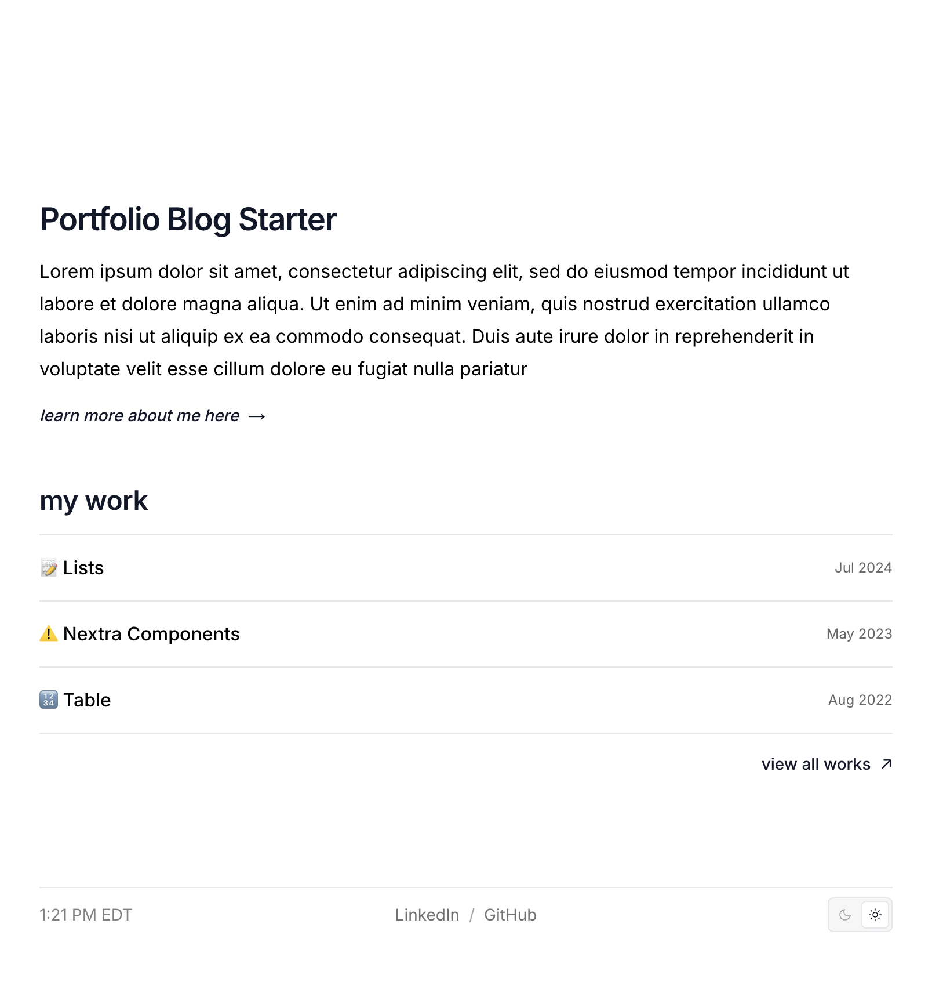
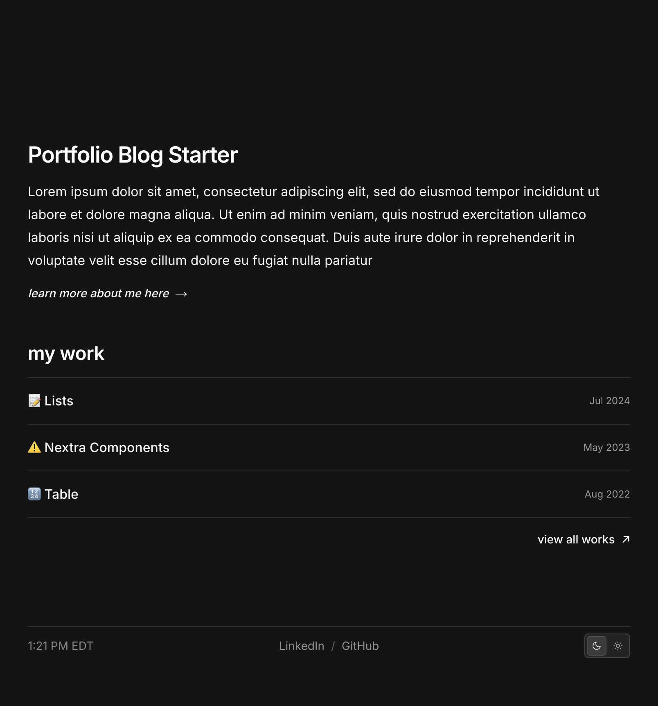
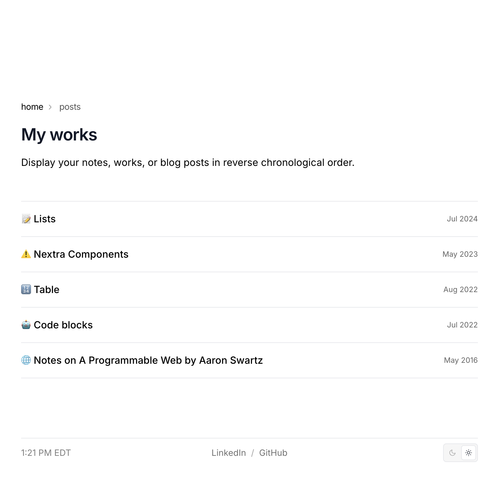
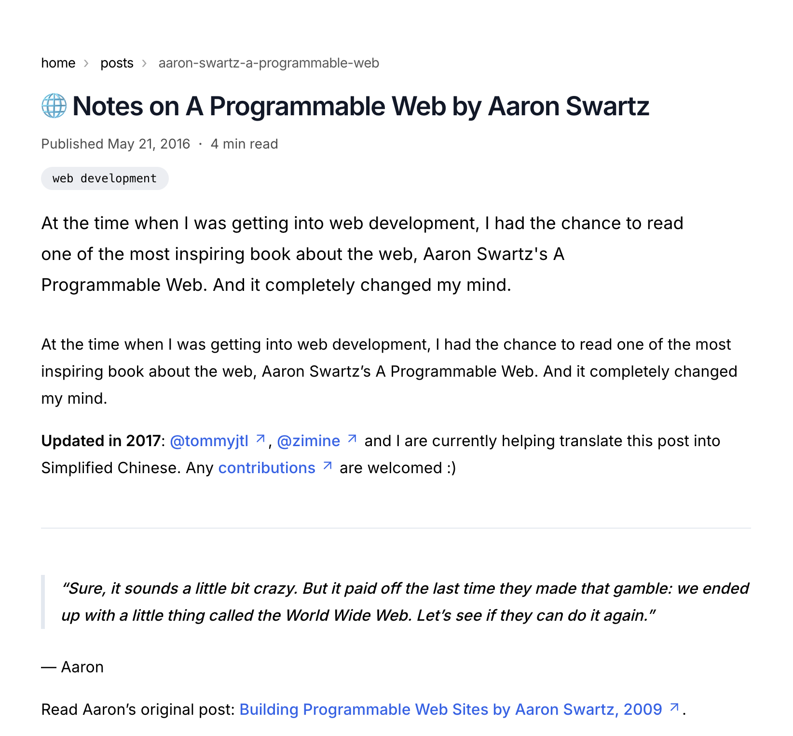

# nextra-portfolio-blog-starter
Create your own Nextra 4.0+ / Next.js 15.3 / Tailwind CSS site for a blog or portfolio

Built using [Nextra's Blog Example](https://github.com/shuding/nextra/tree/c8238813e1ba425cdd72783d57707b0ff3ca52ea/examples/blog)

Home (light) | Home (dark)
:------------:|:------------:
 | 

Works List (light) | Article (light)
:------------------:|:----------------:
 | 

## How to Install
#### Local Development 
Nextra uses [PNPM Workspaces](https://pnpm.io/workspaces)
1. Run `pnpm install` to install the project's dependencies.
2. Run dev server with `pnpm dev` to preview changes

#### Export Site
1. Build static site with `pnpm build` (outputs to `out/`)

## How I made this portfolio / blog starter
This site was developed with [Nextra's blog template](https://github.com/shuding/nextra/tree/c8238813e1ba425cdd72783d57707b0ff3ca52ea/examples/blog) and using OpenAI's [Codex CLI](https://developers.openai.com/codex/cli/).

When building [my portfolio website](nickgentz.com), I was inspired by the many minimal next.js portfolio sites available, but wanted something that was free, lightweight, and easy to update with `.mdx` files. This need led to me building this template and wanting to make it *open source*.  

#### Inspirations
- [Henning Birgersson](https://www.henningbirgersson.com/)
- [Ganesh Kumar](gktk.us)
- [Max Leiter](https://maxleiter.com/)
- [Nils Helmersson](https://nils.io/)
  
## Usage and License
This project is open source and available under the [MIT License](https://github.com/nGentz/nextra-portfolio-blog-starter/blob/main/LICENSE).  
You’re free to use, modify, and distribute it with proper attribution.
